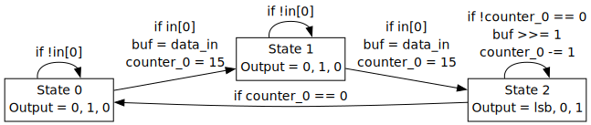
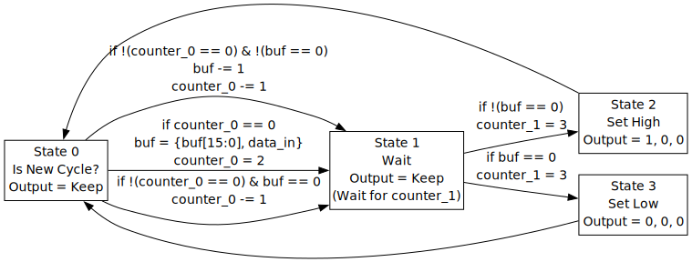
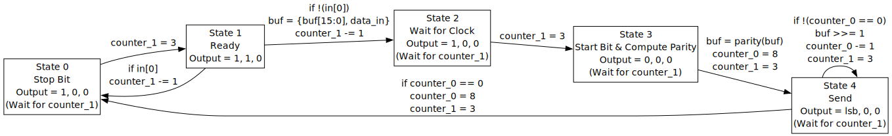

# State Machine Controller for Heichips25

**Note:** This repository is a work in progress and may contain bugs or incomplete features.
This repository is based on the heichips25 template repository, see the [original README](README_TEMPLATE.md).
This project was inspired by the [PRISM](https://github.com/TinyTapeout/ttsky25a-tinyQV/blob/main/docs/user_peripherals/08_prism.md) reconfigurable state machine controller from the TinyTapeout tinyQV challenge.

A programmable state machine controller for the Heichips25 tapeout.
It can be programmed to implement a wide variety of state machine based designs, such as:

- Serializer/Deserializer
- Pulse Width Modulation (PWM)
- UART
- ...

See the [testbench](tb/testbench.py) for example programs.

The controller includes two 16-bit counters and a 24-bit register which can be used as a shift-register or an additional counter.
The state machine can be programmed with up to 8 states.
Transitions can issue one instruction to the counters and one instruction to the 24-bit register respectively, and can be conditional on register, counter or input values.
Each state may have up to 2 outgoing transitions, with one extended state supporting up to 3 outgoing transitions (though in this case only 7 states are supported).
A slow mode allows dividing the clock using the second counter register, effectively allowing for an additional loop transition based on the second counter register for each state.
Outputs depend on the current state (Moore machine).

## Gallery

### 16-bit Serializer

### Pulse Width Modulation (PWM)

### UART TX with Parity Bit

## License

The code in this repository is licensed under Apache 2.0.
